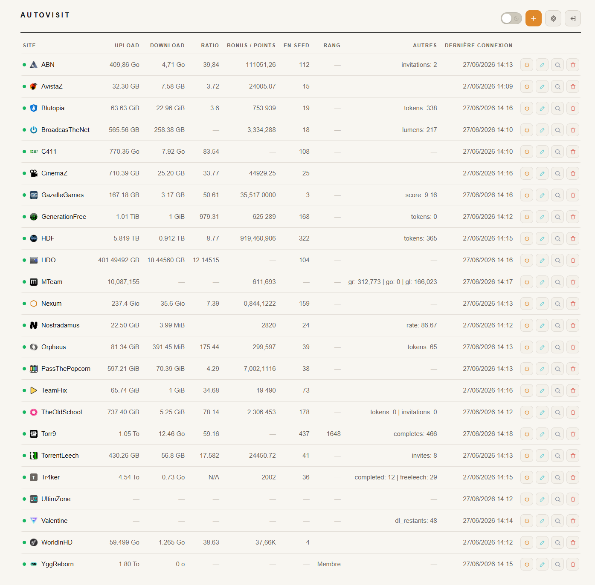
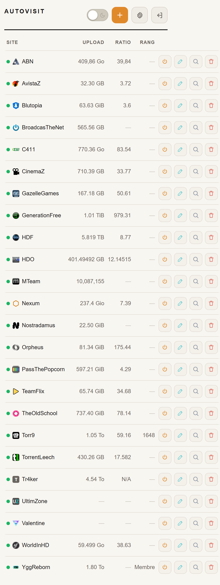

# tracker-autovisit

Petit script Python qui passe quotidiennement sur des sites privés histoire de ne pas se faire désactiver le compte pour cause d'inactivité — parce que constater au bout de trois mois qu'on n'a plus accès à son tracker préféré, c'est moyen.

En passant, il collecte, quand c'est possible, quelques statistiques (ratio, upload, download, bonus...) et peut prévenir par mail ou ntfy en cas de message privé reçu ou de site Ko.

Il sait causer avec :

- les formulaires de login classiques (form POST)
- les sites Laravel / UNIT3D, ASP.NET, XenForo, Symfony
- les API JSON (avec ou sans Bearer)
- le TOTP (2FA en ligne ou page dédiée)
- les sites planqués derrière Cloudflare, via [FlareSolverr](https://github.com/FlareSolverr/FlareSolverr)
- les sites avec captcha invisible, via [Playwright](https://playwright.dev/) (Firefox headless)
- les sites dont le login est tout bonnement infranchissable, via cookies de session pré-exportés

Fork divergent de [Gusdezup/Autovisit](https://github.com/Gusdezup/Autovisit).

---

## Aperçu

<p align="center">
  
  &nbsp;&nbsp;
  
</p>

---

## Prérequis

**Debian / Debian like — installer Python et pip si pas déjà présents :**

```bash
apt install python3 python3-pip
```

L'installation des dépendances Python se fait ensuite en plusieurs temps selon les sites visés.
Mais pour les feignasses et les pressés ce sera:
```bash
pip install requests pyotp curl_cffi playwright --break-system-packages && playwright install firefox
```
Et bien sûr le conteneur FlareSolverr:
```bash
docker run -d --name flaresolverr --restart unless-stopped \
  -p 127.0.0.1:8191:8191 ghcr.io/flaresolverr/flaresolverr:latest
```

Sinon:
**Le minimum** (login form classique, API JSON) :

```bash
pip install requests pyotp --break-system-packages
```

**Pour les sites planqués derrière Cloudflare ou avec une protection anti-bot un peu sévère** — ajouter `curl_cffi`, qui imite l'empreinte TLS de Firefox :

```bash
pip install curl_cffi --break-system-packages
```

**Pour les sites avec captcha invisible** (hCaptcha, Cloudflare Turnstile et autres joyeusetés) — ajouter Playwright et son Firefox headless :

```bash
pip install playwright --break-system-packages && playwright install firefox
```

**Pour les sites avec un vrai challenge Cloudflare** que Playwright ne franchit pas tout seul — installer [FlareSolverr](https://github.com/FlareSolverr/FlareSolverr) à côté, idéalement dans un conteneur Docker, et le laisser tourner en permanence :

```bash
docker run -d --name flaresolverr --restart unless-stopped \
  -p 127.0.0.1:8191:8191 ghcr.io/flaresolverr/flaresolverr:latest
```

Une instance suffit pour tous les sites concernés.

---

## Installation

```bash
git clone https://github.com/lol-powa/tracker-autovisit.git /opt/tracker-autovisit
cd /opt/tracker-autovisit
mkdir -p /opt/tracker-autovisit/data/{sites.d,cookies,logs}
```

Pour les dépendances Python, voir la section [Prérequis](#prérequis) plus haut.

Ensuite, créer un fichier par site dans `data/sites.d/` (voir les exemples de configuration plus bas) et c'est parti :

```bash
/opt/tracker-autovisit/autovisit.py --site MonSite --verbose
```

### Notifications (optionnel)

Au premier lancement, copier le template puis l'éditer :
```bash
cp data/config.example.json data/config.json
```

Pour activer les notifications mail et/ou ntfy, éditer `data/config.json` :

```json
{
    "mail": {
        "enabled": true,
        "to": "autovisit@example.org"
    },
    "ntfy": {
        "enabled": true,
        "url": "https://ntfy.example.org",
        "topic": "autovisit",
        "auth_user": "autovisit",
        "auth_pass": "CHANGE_ME",
        "priority": 4,
        "tags": "warning"
    }
}
```

Mail via msmtp (à configurer côté système, root), ntfy via HTTP POST avec auth basique.

Le fichier `data/config.json` est requis pour lancer le script ; sans lui, le script s'arrête avec une erreur explicite. Les sections `mail` et `ntfy` peuvent être désactivées (`enabled: false`), auquel cas seul le journal local est écrit.

---

## Configuration

La configuration globale (mail, ntfy) est dans `data/config.json`.
Chaque site a son propre fichier dans `data/sites.d/<slug>.json` (slug = nom du site en minuscules).

### Structure générale

`data/config.json` (configuration globale) :

```json
{
    "mail": {
        "enabled": true,
        "to": "autovisit@example.org"
    },
    "ntfy": {
        "enabled": true,
        "url": "https://ntfy.example.org",
        "topic": "autovisit",
        "auth_user": "autovisit",
        "auth_pass": "CHANGE_ME",
        "priority": 4,
        "tags": "warning"
    },
    "retention": {
        "history_days": 90,
        "logs_days": 90
    }
}
```

Le bloc `retention` est optionnel. Si présent, le script purge silencieusement au démarrage les snapshots SQLite et les fichiers `visit_YYYY-MM.log` plus anciens que les durées indiquées. Mettre `0` (ou omettre la clé) désactive la purge correspondante.

`data/sites.d/<slug>.json` (un fichier par site, objet site brut) :

```json
{
    "name": "MonSite",
    "url": "https://monsite.example/",
    "post_url": "https://monsite.example/login.php",
    "username_field": "username",
    "password_field": "password",
    "username": "...",
    "password": "...",
    "verify_url": "https://monsite.example/",
    "success_keywords": ["..."],
    "enabled": true
}
```

> Pour les configurations personnelles de sites, vous pouvez utiliser un fichier `SITES.md` local (gitignored) qui permettra de garder vos modèles, champs et observations site par site sans rien commiter.

### Champs disponibles par site

| Champ | Obligatoire | Description |
|---|---|---|
| `name` | ✅ | Nom du site (logs et notifications) |
| `url` | ✅ | URL de la page de login (GET initial) |
| `post_url` | ✅ | URL cible du formulaire POST |
| `username_field` | ✅ | Nom du champ username dans le formulaire |
| `password_field` | ✅ | Nom du champ password dans le formulaire |
| `username` | ✅ | Identifiant |
| `password` | ✅ | Mot de passe |
| `enabled` | | `true` par défaut. `false` pour désactiver |
| `aliases` | | Noms alternatifs pour `--site` |
| `csrf_field` | | Nom du champ CSRF si non standard (ex: `__RequestVerificationToken`, `_csrf_token`) |
| `extract_hidden_fields` | | `true` pour extraire automatiquement les champs hidden anti-bot (Laravel/UNIT3D) |
| `extra_fields` | | Champs supplémentaires à inclure dans le POST (ex: honeypot `{"_username": ""}`) |
| `extra_headers` | | Headers HTTP supplémentaires |
| `pre_visit_urls` | | URLs à charger avant le login (initialisation de session) |
| `verify_url` | | URL à charger après login pour vérifier la connexion et extraire les stats |
| `success_url_contains` | | Texte attendu dans l'URL après connexion |
| `success_keywords` | | Mots-clés attendus dans le HTML après connexion |
| `success_json_field` | | Champ JSON attendu dans la réponse API (ex: `"success"`) |
| `alert_keywords` | | Mots-clés déclenchant une alerte MP (substring exact du HTML) |
| `alert_stat` | | Nom d'une clé de `stats` à surveiller : si sa valeur numérique est > 0, déclenche une alerte MP. Le compteur est exclu de l'affichage des stats. |
| `alert_label` | | Libellé de l'alerte MP dans les logs et notifications (défaut : le mot-clé ou la clé surveillée) |
| `stats` | | Dict d'expressions régulières pour extraire les statistiques depuis le HTML |
| `stats_json` | | Dict de chemins de clés pour extraire les statistiques depuis une réponse JSON |
| `extra_url` | | URL complémentaire interrogée après `verify_url` pour récupérer des stats absentes de la page principale (FL tokens, seeding count, bonus...). Ses résultats sont fusionnés dans l'unique ligne `Stats --` du journal avant historisation |
| `extra_stats` | | Dict d'expressions à appliquer sur `extra_url`. Format identique à `stats` (regex polymorphe) si `extra_format: "html"`, ou à `stats_json` (chemins pointés) si `extra_format: "json"` |
| `extra_format` | | `"json"` (défaut) ou `"html"`. Détermine comment `extra_stats` est interprété. Toute autre valeur déclenche un warning et fallback JSON |
| `mp_url` | | URL d'une API JSON pour vérifier les MP non lus |
| `mp_json_field` | | Champ JSON à vérifier dans la réponse `mp_url` (défaut: `total`) |
| `totp_secret` | | Secret TOTP base32 pour le 2FA |
| `totp_field` | | Nom du champ TOTP (défaut: `mfa`) |
| `totp_url` | | URL de la page 2FA dédiée (si étape séparée) |
| `api_json` | | `true` si le login se fait via API JSON |
| `use_curl_cffi` | | `true` pour les sites Cloudflare / anti-bot (impersonne Firefox) |
| `use_playwright` | | `true` pour les sites avec captcha invisible (Firefox headless) |
| `playwright_submit` | | Sélecteur CSS du bouton de soumission (défaut: `button[type=submit]`) |
| `playwright_password_selector` | | Sélecteur CSS du champ password (ex: `#private-key-input`). Si défini, le mode password-only est activé : `username_field` peut rester vide |
| `playwright_post_login_wait` | | Délai (secondes) à attendre après le clic submit. Utile pour les sites WebSocket / PoW JS qui ne déclenchent jamais `networkidle` |
| `playwright_wait_url_change` | | Délai max (secondes) à attendre que l'URL change après le submit. À combiner avec `playwright_post_login_wait` pour les sites lents au redirect (Phoenix LiveView par exemple) |
| `playwright_fetch_verify` | | `true` pour faire le GET `verify_url` directement via Playwright (au lieu de transférer les cookies vers `requests`). Nécessaire pour les sites à fingerprint navigateur strict |
| `playwright_post_verify_wait` | | Délai (secondes) à attendre après navigation vers `verify_url` en mode `playwright_fetch_verify` (défaut: `3`) |
| `playwright_intercept` | | Liste d'URLs d'API à intercepter pendant la navigation Playwright |
| `playwright_stats_url` | | URL parmi `playwright_intercept` contenant les données de stats (`stats_json` appliqué dessus) |
| `session_cookies_file` | | Chemin vers un fichier JSON contenant des cookies de session pré-existants. Si défini, le login est totalement contourné |
| `user_agent` | | User-Agent à utiliser. **Obligatoire** avec `session_cookies_file` (sauf si `cf_solver` est défini, auquel cas FlareSolverr impose le sien) |
| `cf_solver` | | URL d'une instance FlareSolverr (ex. `http://127.0.0.1:8191/v1`). Résout le challenge Cloudflare à la volée et rend `session_cookies_file` et `user_agent` optionnels |
| `cf_solver_timeout` | | Délai max (secondes) accordé à FlareSolverr pour résoudre le challenge (défaut : 60) |

---

## Détection CSRF automatique

Le script détecte automatiquement le token CSRF selon le framework :

| Framework | Méthode de détection |
|---|---|
| Laravel | `<meta name="csrf-token">` ou `<input name="_token">` |
| Flask | `<input name="csrf_token">` |
| Symfony | `<input name="_csrf_token">` |
| ASP.NET | `<input name="__RequestVerificationToken">` |
| XenForo | `<input name="_xfToken">` |

Pour un champ au nom non standard, le déclarer via `"csrf_field": "NOM_DU_CHAMP"`.

---

## Protection anti-bot (champs hidden)

Certains sites (Laravel, UNIT3D) injectent des champs "hidden" (cachés) aléatoires dans le formulaire pour piéger les bots. L'option `"extract_hidden_fields": true` les inclut automatiquement dans le POST.

Si le site utilise en plus un champ honeypot de type `text` (non hidden), il faut l'ajouter à la main :

```json
"extra_fields": {"_username": ""}
```

---

## Statistiques

Le champ `stats` accepte un dictionnaire d'expressions régulières appliquées sur le HTML après connexion. Le champ `stats_json` accepte un dictionnaire de chemins de clés appliqués sur une réponse JSON (via `verify_url` ou `mp_url`).

```json
"stats": {
  "upload": "EXPRESSION_REGEX",
  "ratio": "EXPRESSION_REGEX"
},
"stats_json": {
  "upload": "user.uploaded",
  "ratio": "user.ratio"
}
```

Les expressions `stats` utilisent `re.DOTALL | re.IGNORECASE`. Les clés `stats_json` supportent la notation pointée pour les objets imbriqués (`"user.stats.ratio"`). Les clés contenant `upload`, `download`, `bytes` ou `size` sont automatiquement converties en unités lisibles (Ko/Mo/Go/To).

### Stats complémentaires (`extra_url`)

Certaines stats vivent ailleurs que sur la page principale : FL tokens sur une page d'historique, compteur de torrents en seed sur une page "torrents actifs", bonus cumulé sur une page profil. C'est ce que `extra_url` permet d'aller chercher, avec `extra_stats` pour les expressions et `extra_format` pour piloter le format (`"json"` par défaut, ou `"html"`).

Exemple HTML — cumul de seeding sur une page séparée :

```json
"verify_url": "https://monsite.example/profile",
"stats": {
  "ratio": "Ratio:\\s*([\\d.]+)",
  "upload": {"pattern": "Upload:\\s*([\\d.]+)\\s*([KMGT]B)", "unit": "auto"}
},
"extra_url": "https://monsite.example/account/active-torrents",
"extra_format": "html",
"extra_stats": {
  "seeding": "(\\d+)\\s+en partage"
}
```

Exemple JSON — FL tokens via API :

```json
"extra_url": "https://monsite.example/api/user/bonus",
"extra_format": "json",
"extra_stats": {
  "tokens": "data.tokens.freeleech",
  "bonus": "data.points"
}
```

Stats principales et complémentaires sont fusionnées dans une seule ligne `Stats --` (et un seul snapshot BDD) à chaque exécution.

### Compatibilité par chemin de visite

| Fonction | `extra_url` supporté |
|---|---|
| `visit_site()` (auth username/password classique) | ✅ |
| `visit_site_session()` (cookies pré-existants ou FlareSolverr) | ✅ |
| `visit_site_playwright()` (Firefox headless) | ❌ |

Pour les sites Playwright, passer par `playwright_intercept` + `playwright_stats_url` (interception XHR/fetch d'une URL d'API exposée par la SPA).

---

## Exemples de configuration

### Site classique (form POST)

```json
{
  "name": "MonSite",
  "url": "https://monsite.com/login",
  "post_url": "https://monsite.com/login",
  "username_field": "username",
  "password_field": "password",
  "success_keywords": ["Déconnexion"],
  "alert_keywords": ["new_message"],
  "username": "monpseudo",
  "password": "monmotdepasse",
  "enabled": true
}
```

### Site Gazelle avec TOTP inline

```json
{
  "name": "MonSiteGazelle",
  "url": "https://monsite.com/login.php",
  "post_url": "https://monsite.com/login.php",
  "username_field": "username",
  "password_field": "password",
  "totp_secret": "SECRET_BASE32",
  "totp_field": "mfa",
  "success_url_contains": "index.php",
  "success_keywords": ["Déconnexion"],
  "alert_keywords": ["new_message"],
  "stats": {
    "upload": "class=\"stat tooltip up\"[^>]*>([^<]+)</span>",
    "download": "class=\"stat tooltip dl\"[^>]*>([^<]+)</span>",
    "ratio": "class=\"tooltip r\\d+\"[^>]*>([^<]+)</span>"
  },
  "username": "monpseudo",
  "password": "monmotdepasse",
  "enabled": true
}
```

### Site Laravel/UNIT3D avec protection anti-bot

```json
{
  "name": "MonSiteUNIT3D",
  "url": "https://monsite.com/login",
  "post_url": "https://monsite.com/login",
  "username_field": "username",
  "password_field": "password",
  "csrf_field": "_token",
  "extract_hidden_fields": true,
  "extra_fields": {"_username": ""},
  "verify_url": "https://monsite.com/",
  "success_keywords": ["Déconnexion"],
  "alert_keywords": ["viewBox=\"0 0 100 100\""],
  "use_curl_cffi": true,
  "username": "monpseudo",
  "password": "monmotdepasse",
  "enabled": true
}
```

### Site UNIT3D avec captcha invisible (Playwright)

```json
{
  "name": "MonSiteUNIT3D",
  "url": "https://monsite.com/login",
  "post_url": "https://monsite.com/login",
  "username_field": "username",
  "password_field": "password",
  "use_playwright": true,
  "playwright_submit": "button.auth-form__primary-button",
  "totp_secret": "SECRET_BASE32",
  "totp_field": "code",
  "verify_url": "https://monsite.com/",
  "success_keywords": ["monpseudo"],
  "stats": {
    "upload": "ratio-bar__uploaded[^>]*>\\s*<a[^>]*>\\s*<i[^>]+></i>\\s*([^<]+)",
    "ratio": "ratio-bar__ratio[^>]*>\\s*<a[^>]*>\\s*<i[^>]+></i>\\s*([^<]+)"
  },
  "username": "monpseudo",
  "password": "monmotdepasse",
  "enabled": true
}
```

### Site SPA avec interception API (Playwright)

Pour les sites où stats et MP sont chargés dynamiquement par des appels API (Vue, React, Svelte et compagnie), Playwright peut écouter les réponses réseau pendant la navigation et en tirer les données — ça évite de bricoler du parsing HTML rendu, qui dans ce genre de SPA est de toute façon souvent à moitié vide au chargement.

```json
{
  "name": "MonTrackerSPA",
  "url": "https://monsite.com/login",
  "username_field": "identifier",
  "password_field": "password",
  "use_playwright": true,
  "playwright_intercept": [
    "https://monsite.com/api/me",
    "https://monsite.com/api/me/notifications/unread"
  ],
  "playwright_stats_url": "https://monsite.com/api/me",
  "stats_json": {
    "upload": "uploaded",
    "download": "downloaded",
    "ratio": "ratio"
  },
  "mp_url": "https://monsite.com/api/me/notifications/unread",
  "mp_json_field": "total",
  "username": "monpseudo",
  "password": "monmotdepasse",
  "enabled": true
}
```

> `playwright_intercept` liste les URLs à intercepter. `playwright_stats_url` indique laquelle contient les stats (`stats_json` lui est appliqué). `mp_url` + `mp_json_field` fonctionnent de la même façon que pour les sites non-Playwright.

### Site Phoenix LiveView / authentification par clé privée (Playwright)

Pour les sites Phoenix LiveView avec login par clé privée (challenge/signature) et PoW JavaScript de type Anubis. Login en WebSocket, session collée au fingerprint navigateur — autant dire que sortir de Playwright pour le GET de vérification ne marchera jamais. D'où `playwright_fetch_verify: true`, qui garde tout le pipeline dans le même navigateur.

```json
{
  "name": "MonSitePhoenix",
  "url": "https://monsite.com/sign-in",
  "username_field": "",
  "password_field": "password",
  "use_playwright": true,
  "playwright_password_selector": "#private-key-input",
  "playwright_wait_url_change": 30,
  "playwright_post_login_wait": 5,
  "playwright_fetch_verify": true,
  "playwright_post_verify_wait": 5,
  "verify_url": "https://monsite.com/activity",
  "success_keywords": ["monpseudo"],
  "stats": {
    "upload": "Upload total</div>\\s*<div[^>]*>([^<]+)</div>",
    "download": "Download total</div>\\s*<div[^>]*>([^<]+)</div>"
  },
  "username": "",
  "password": "MA_CLE_PRIVEE",
  "enabled": true
}
```

> `playwright_password_selector` active le mode password-only et cible un champ par sélecteur CSS plutôt que par `name`. `playwright_wait_url_change` attend que l'URL change après le submit (plus fiable qu'un délai fixe pour les WebSockets Phoenix LiveView). `playwright_fetch_verify` fait le GET de vérification depuis le même navigateur Playwright pour préserver le fingerprint requis par l'anti-bot.

### Site avec login bloqué (cookies de session)

Pour les sites dont le login est totalement infranchissable côté script (Cloudflare `cf-mitigated`, hCaptcha cliquable, CAPTCHA visuel et autres réjouissances), on saute carrément l'étape login et on réutilise les cookies d'une session ouverte à la main dans un navigateur.

```json
{
  "name": "MonSiteBloque",
  "aliases": ["bloque"],
  "session_cookies_file": "/chemin/vers/cookies/monsite.json",
  "user_agent": "Mozilla/5.0 (Windows NT 10.0; Win64; x64) AppleWebKit/537.36 (KHTML, like Gecko) Chrome/149.0.0.0 Safari/537.36",
  "verify_url": "https://monsite.com/",
  "success_keywords": ["Déconnexion"],
  "stats": {
    "upload": "Up:\\s*<span class=\"stat\">([^<]+)</span>"
  },
  "username": "",
  "password": "",
  "enabled": true
}
```

Le fichier `cookies/monsite.json` doit contenir un tableau d'objets cookies au format Cookie-Editor :

```json
[
  {"name": "PHPSESSID", "value": "...", "domain": "monsite.com", "path": "/"},
  {"name": "cf_clearance", "value": "...", "domain": ".monsite.com", "path": "/"}
]
```

> **Récupération des cookies** : se connecter manuellement au site dans un navigateur, ouvrir les DevTools (F12) → Application → Cookies, copier ceux qui comptent (au minimum le cookie de session, plus `cf_clearance` si présent). L'extension Cookie-Editor fait ça en deux clics et donne directement un export JSON propre.
>
> **À garder en tête** :
> - Les cookies expirent. Selon le site, ça tient de quelques jours à plusieurs mois. Le log `cookies expires ?` est le signal pour regénérer le fichier.
> - Le cookie `cf_clearance` (Cloudflare) est lié à l'**IP** ET au **User-Agent**. Si les cookies viennent d'un PC perso, la seedbox qui exécute le script doit sortir sur la même IP publique (ou tunnel SSH/SOCKS), et le `user_agent` de la config doit reprendre exactement celui du navigateur d'origine.
> - Protéger le fichier : `chmod 600 cookies/monsite.json`

**Mode hybride (Cloudflare uniquement)** : si le fichier cookies contient juste `cf_clearance` et que la config a bien `username` / `password` / `post_url`, le script fait le login classique derrière le cookie Cloudflare. C'est bien plus robuste que de stocker un cookie de session, qui peut être de très courte durée.

### Contournement Cloudflare automatisé (FlareSolverr)

Plutôt que de coller un `cf_clearance` à la main (qui expire vite, parfois en moins de 24 h), la clé `cf_solver` délègue la résolution du challenge à une instance FlareSolverr :

```json
{
    "name": "MonSite",
    "cf_solver": "http://127.0.0.1:8191/v1",
    "verify_url": "https://monsite.com/index.php",
    "url": "https://monsite.com/login.php",
    "post_url": "https://monsite.com/login.php",
    "username_field": "username",
    "password_field": "password",
    "username": "...",
    "password": "...",
    "success_keywords": ["logout.php"]
}
```

À chaque visite, le script envoie l'URL cible à FlareSolverr, qui renvoie le `cf_clearance` valide **et** le User-Agent utilisé pour l'obtenir. Le script reprend ce User-Agent pour la session (le `cf_clearance` y est lié), donc l'`user_agent` du fichier de config n'est plus nécessaire. Le login classique s'enchaîne derrière le cookie Cloudflare, comme en mode hybride.

Comme le cookie est régénéré à chaque exécution, plus rien à coller ni à renouveler à la main. Seule contrainte qui persiste : FlareSolverr doit sortir sur Internet par la même IP publique que le script (cf. la note plus haut sur `cf_clearance` lié à l'IP).

### Site ASP.NET

```json
{
  "name": "MonSiteASP",
  "url": "https://monsite.com/login",
  "post_url": "https://monsite.com/login",
  "username_field": "Username",
  "password_field": "Password",
  "csrf_field": "__RequestVerificationToken",
  "success_keywords": ["Déconnexion"],
  "username": "monpseudo",
  "password": "monmotdepasse",
  "enabled": true
}
```

### Site XenForo avec TOTP page dédiée

```json
{
  "name": "MonSiteXenForo",
  "url": "https://monsite.com/login",
  "post_url": "https://monsite.com/login",
  "username_field": "login",
  "password_field": "password",
  "csrf_field": "_xfToken",
  "extract_hidden_fields": true,
  "totp_secret": "SECRET_BASE32",
  "totp_field": "code",
  "totp_url": "https://monsite.com/login/two-step",
  "success_keywords": ["Déconnexion"],
  "username": "monpseudo",
  "password": "monmotdepasse",
  "enabled": true
}
```

### Site API JSON avec stats JSON et MP via URL dédiée

```json
{
  "name": "MonTrackerAPI",
  "url": "https://monsite.com/login",
  "pre_visit_urls": ["https://monsite.com/api/settings/public"],
  "post_url": "https://monsite.com/api/auth/login",
  "username_field": "username",
  "password_field": "password",
  "api_json": true,
  "success_json_field": "success",
  "verify_url": "https://monsite.com/api/auth/me",
  "stats_json": {
    "upload": "user.uploaded",
    "download": "user.downloaded",
    "ratio": "user.ratio"
  },
  "mp_url": "https://monsite.com/api/messages/unread-count",
  "mp_json_field": "total",
  "username": "monpseudo",
  "password": "monmotdepasse",
  "enabled": true
}
```

### Login AJAX (réponse vide, vérification sur une autre page)

```json
{
  "name": "MonForum",
  "url": "https://monforum.com/",
  "post_url": "https://monforum.com/includes/login.php?action=login",
  "username_field": "pseudo",
  "password_field": "password",
  "extra_headers": {"X-Requested-With": "XMLHttpRequest"},
  "verify_url": "https://monforum.com/",
  "success_keywords": ["Mon profil"],
  "username": "monpseudo",
  "password": "monmotdepasse",
  "enabled": true
}
```

---

## Utilisation

```bash
# Mode par défaut : aucune notification si tout va bien
autovisit

# Silencieux total (aucune notification, même en cas d'erreur)
autovisit --silent

# Affiche uniquement les lignes Stats de l'exécution en cours
autovisit --stats

# Notifie systématiquement (récap mail détaillé + ntfy s'il y a KO ou MP)
autovisit --verbose

# Exporte un status.json après l'exécution (utilisé par la page web)
autovisit --json-output

# Un seul site (par nom ou alias)
autovisit --site MonSite
autovisit --site s1

# Plusieurs sites
autovisit --site MonSite MonSite2

# Combinaisons
autovisit --site MonSite --verbose
autovisit --json-output --verbose
```

Les notifications mail et ntfy sont activées par défaut si `data/config.json` est présent. Sans `--silent` ni `--verbose`, c'est ntfy qui prévient seulement s'il y a un échec ou un MP non lu — pas de bruit quand tout va bien.

---

## Planification Crontab

Une fois par jour suffit largement. À heure creuse, idéalement.

```bash
0 6 * * * /opt/tracker-autovisit/autovisit.py --json-output >> /opt/tracker-autovisit/data/logs/cron.log 2>&1
```

`--json-output` génère le `status.json` qui alimente la page web, et la matrice de notifications fait le reste : ntfy prévient en cas d'échec ou de MP non lu, le mail reste silencieux sauf en mode `--verbose`.

---

## Interface web

La page `web/index.html` affiche les stats de tous les sites en lisant `data/status.json` (généré par `autovisit --json-output`).

### Déploiement

```bash
mkdir -p /var/www/autovisit
cp web/index.html /var/www/autovisit/
cp web/icones/* /var/www/autovisit/icones/
chown -R www-data:www-data /var/www/autovisit
```

`status.json` ne va pas dans la racine web : il reste dans `data/` et est exposé via un alias Nginx avec restriction d'accès. Inutile que les mots de passe en clair des autres fichiers `data/` se retrouvent à un `../` près.

### Configuration Nginx

Le bloc à ajouter dans le `server { listen 443 ssl; ... }` :

```nginx
location = /status.json {
    alias /opt/tracker-autovisit/data/status.json;
    satisfy any;
    allow x.x.x.0/24;
    deny all;
    add_header Cache-Control "no-store, no-cache, must-revalidate";
}
```

`satisfy any` combiné à `allow`/`deny` permet l'accès direct depuis le LAN (`x.x.x.0/24`) ou via `auth_basic` depuis l'extérieur. Adapter le CIDR au réseau local.

### Permissions

`status.json` doit être lisible par `www-data` (par défaut, `umask 022` produit `-rw-r--r--`, ce qui convient). Le dossier `data/` doit être traversable (`o+x`).

---

## Alertes MP

Trois mécanismes complémentaires, à choisir selon ce que le site expose.

**`alert_keywords`** repère une chaîne exacte dans le HTML après connexion. La valeur doit être unique sur la page et n'apparaître que lorsqu'il y a un message non lu (typiquement une classe CSS « highlighted », un badge spécifique ou un libellé du genre « 3 nouveaux messages »).

**`alert_stat`** surveille une statistique déjà extraite (une clé de `stats`) : si sa valeur numérique dépasse 0, l'alerte se déclenche. Pratique quand le site expose un compteur de messages non lus qu'on récupère par ailleurs comme stat. Le compteur disparaît de la ligne `Stats --` pour ne pas polluer.

**`mp_url`** interroge une URL d'API JSON dédiée. La valeur du champ `mp_json_field` (défaut : `total`) est comparée à `0` — si elle est strictement supérieure, l'alerte se déclenche. La notation pointée est supportée (`meta.unreadCount`, par exemple).

Côté notification, ntfy reçoit une ligne compacte du genre `MP: NomDuSite1, NomDuSite2` et le mail (mode `--verbose`) liste chaque MP dans la section qui va bien.

---

## Sécurité

- Les fichiers `data/config.json` et `data/sites.d/*.json` contiennent les mots de passe et secrets TOTP en clair. À protéger d'urgence : `chmod 600 data/config.json data/sites.d/*.json`
- Ne jamais partager le contenu de `data/` (au cas où ce ne soit pas évident)
- Les fichiers de cookies de session (`session_cookies_file`) méritent le même traitement : `chmod 600 data/cookies/*.json`
- `SITES.md` (notes personnelles de configuration) est dans le `.gitignore` — éviter de le sortir de là par mégarde

---

## Liste des sites configurés

```bash
autovisit --list
```

Affiche un récapitulatif de tous les sites présents dans `data/sites.d/` :

| Colonne | Description |
|---|---|
| Nom | Nom du site |
| Actif | Site activé ou non |
| URL | Domaine |
| TOTP | Secret TOTP configuré |
| 2FA | Type de 2FA (inline, page, api_json) |
| Stats | Expressions `stats` ou `stats_json` configurées |
| MP | `alert_keywords`, `alert_stat` ou `mp_url` configurés |
| Curl | `use_curl_cffi` activé |
